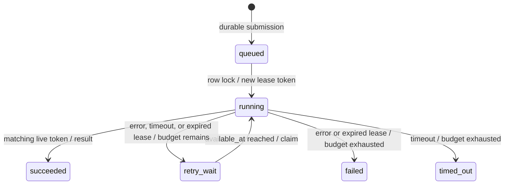

# Architecture and failure semantics

## Sources of truth

PostgreSQL owns job identity, status, payload, attempt budget, availability time, lease token, result, and event history. Redis is a rebuildable delivery index and ephemeral worker health store.

Submission creates a queued job and its first event in one database transaction. A request idempotency key has a unique database constraint and a normalized request hash. PostgreSQL intake uses a short advisory transaction lock to make capacity accounting and idempotent submission deterministic. That lock does not cover task execution.

Workers periodically scan due queued/retry rows with `FOR UPDATE SKIP LOCKED`. A worker publishes each ID to one of three Redis sorted sets, then sets the next redelivery time. This durable row plus dispatch marker is an outbox-style mechanism; there is no fragile database-then-one-shot-enqueue dependency. Multiple dispatch loops can run.

The Redis Lua pop checks high, normal, then low priority atomically. Within a priority, the score is job creation time. Identical timestamp scores fall back to Redis member ordering. Priority is non-preemptive and applies to currently published ready work, not future retries or tasks already running.

## State machine

Each claim creates exactly one persisted attempt and increments the attempt counter under the row lock. Each attempt has its own token. Success, failure, and event writes commit together.

The worker spawns a task subprocess and waits on a result pipe. The worker process remains available for heartbeat updates. On a timeout it terminates, joins, and if needed kills that subprocess. On normal worker shutdown it finishes the current bounded attempt before exiting. Compose allows 70 seconds for shutdown.

## Failure matrix

| Failure window | Outcome |
| --- | --- |
| API crashes before database commit | No accepted durable job; client may retry with same key |
| API commits but reply is lost | Same idempotency key returns existing job |
| Redis unavailable after submission | Job remains durable; dispatcher retries after Redis recovers |
| Dispatcher publishes then database commit fails | Duplicate notification is possible; database claim excludes duplicate execution ownership |
| Worker pops then dies before claiming | Dispatcher republishes the still-ready row |
| Worker dies after claim | Lease expires; recovery records lost attempt and schedules retry or terminal failure |
| Result commit fails | Lease recovery eventually retries; already-run code may run again |
| Old worker returns after lease expiration/recovery | Token/deadline check rejects its result |
| Redis data is lost | Dispatcher reconstructs ready work from PostgreSQL |
| All workers are offline | Jobs remain persisted; dispatch/recovery resume when a worker returns |
| PostgreSQL unavailable | Claims and completion pause; workers retry, potentially expiring leases |
| Redis heartbeat unavailable | API reports monitoring unavailable; durable job history is unaffected |

## Guarantees and boundaries

- At-least-once **execution**, bounded by attempt budget.
- One current database owner per job, protected by row locks and token fencing.
- No promise of exactly-once external side effects. Add task-level idempotency for payments, emails, writes to other systems, etc.
- Expired running jobs can be retried after the task timeout plus the lease grace and dispatcher scheduling delay.
- Worker hosts must have synchronized clocks; lease timestamps use wall time. A production extension should use database-derived time or a consistent time authority.
- Default strict-priority scheduling can starve low-priority work under a permanent high-priority stream. Aging or weighted fairness is a future extension.
- Durable event logs and job history grow indefinitely in this version. Add retention/export policies before sustained production use.
- Every registered task has bounded input/output. The child process inherits worker permissions; this is not an arbitrary-code sandbox.
- One shared API key protects the workspace. There is no tenancy, per-user authorization, task cancellation, or task DAG orchestration.
- Redis has no published host port in Compose. On a multi-host deployment, use private networking plus Redis authentication/TLS.
- Worker failure messages in the event timeline may contain task data. Treat PostgreSQL backups as application data.

## Implementation references

- PostgreSQL row locking and SKIP LOCKED: https://www.postgresql.org/docs/current/sql-select.html
- Redis atomic minimum pop: https://redis.io/docs/latest/commands/zpopmin/

